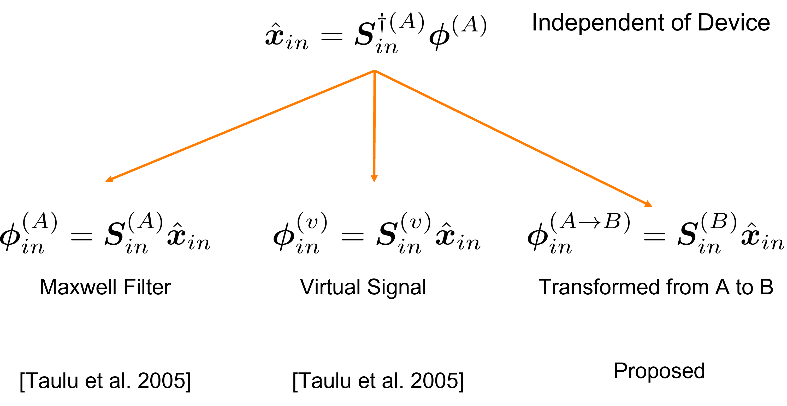
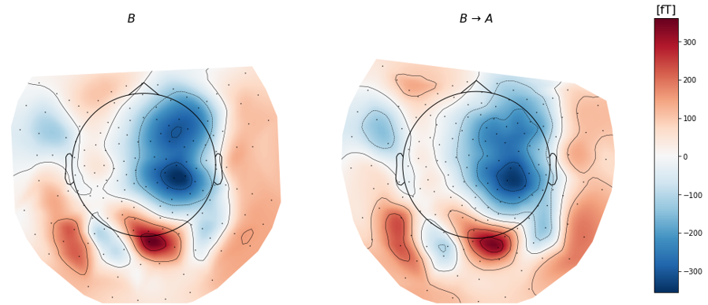

# Converting MEG data across devices 

**Disclaimer**: To use this repository you must first download the BIOMAG21 Dementia screening dataset. The core file of this repository is `libs/maxwell_site_transform.py`. It contains the implementation of the proposed method of transforming MEG data from one recording site to another. Especially the notebooks are not bug-free but can be used as a starting point for testing the subsequently applied neural network.

The BIOMAG21 dataset contains subjects which were recorded on two different recordings sites. We call these sites A and B. Subjects have the following: healthy (HC), dementia (DEM) and mild cognitive impaired MCI.
Sites A and B both have a KIT 160 channel MEG device, but the channels are named differently and the position of the channels can not be perfectly aligned one-to-one. I.e. for a good assignment one would need to drop some MEG channels.

We propose to use signal subspace separation (SSS) (Taulu et al., 2004) to obtain magnetic multipoles which do not depend on the MEG device (see `libs/maxwell_site_transform.py`). Since the multipoles have an exponential power distribution we can not directly use them for our CNN. Instead we transform the multipoles back to a common MEG device (reference frame).

### SSS Method for site transformation

### Result after site transformation

Afterwards we test in `BIOMAG_CNN_SHAP.ipynb` how good the SSS approach worked by asking a CNN to identify the original recording site.

We find that the CNN still can identify the recording site due to other temporal artifacts. We conclude that Deep Learning should not be used for the neurological task of classifying subjects according to DEM, HC and MCI since the neural network can easily exploit the recording site as a confounder.

### Reason why CNN can still identify recording site: differences in temporal dynamic (i.e. PSD)

Future work need to deal with the problem of different temporal artifacts across recording sites.
